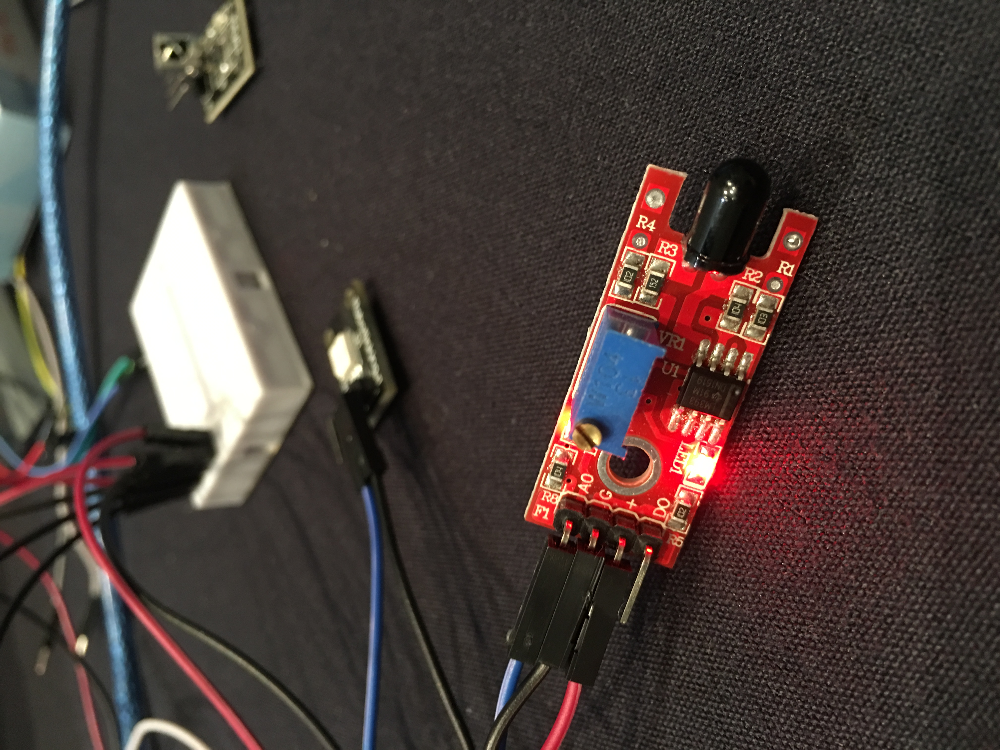
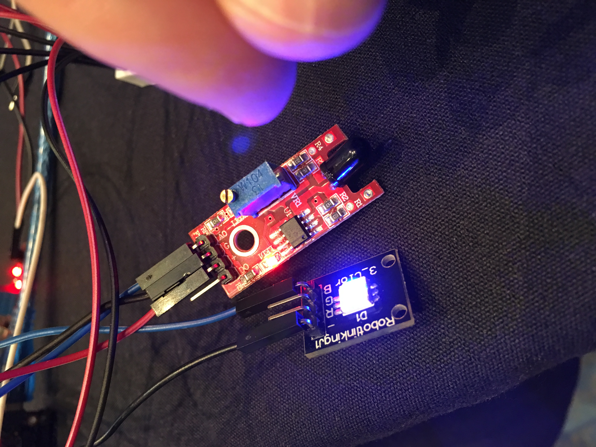
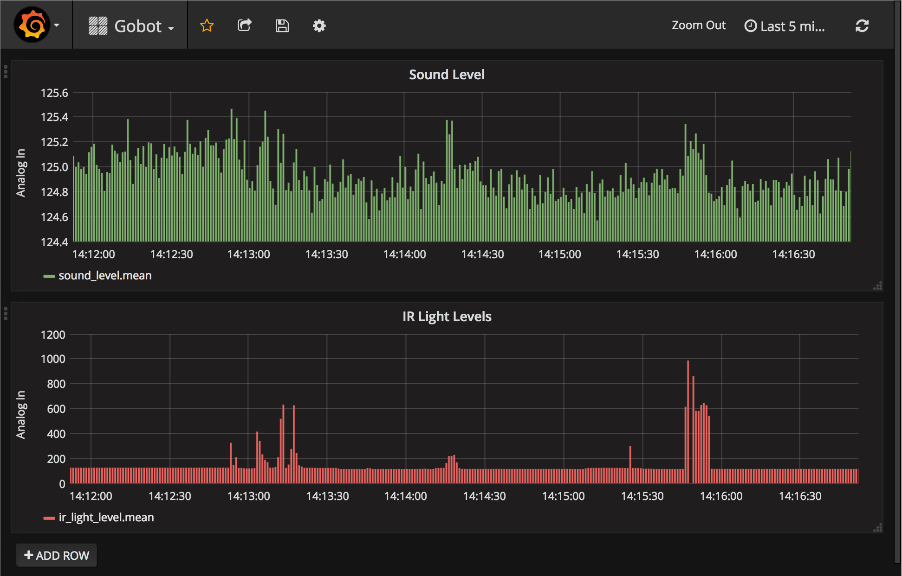

# proximity-alert-gobot

## Intro

When a human gets close to the IR sensor, the LED blinks. Sound and IR data are also graphed.

Realtime data is sent to InfluxDB and graphed via Grafana.

An experiment using Gobot at GopherCon 2017's Hardware Hack Day: https://github.com/hybridgroup/gobot-workshop-2017

Thanks to #gophercon and #gobot -- as well as #intel for providing free #tinytile hardware and a bag full of sensors to play with!

## Setup (on OSX)

* Connect to TinyTile: https://github.com/hybridgroup/gobot-workshop-2017/blob/master/airlock/tinytile/README.md

* Connect up the Sound Sensor and Infrared Emission Sensor: https://github.com/hybridgroup/gobot-workshop-2017/blob/master/starterkit/README.md See source code for pins that were used.

* Install InfluxDB `brew install influxdb` and create a `gobot` database.

* Install Grafana `brew install grafana`

## Run app and collect data

    # See source code for the analog and digital pins
    # that were used.

    cd proximity
    go run proximity.go /dev/tty.usbmodem1411

Sound and IR data will be saved in influxdb, and then graphed via Grafana.
